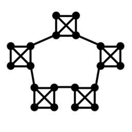

# Random Walk Network Simulation

This project implements a random walk simulation on a network using C. It demonstrates proficiency in several key programming concepts including dynamic memory allocation, use of structs, file I/O, and modular code organization. The random walk is simualted upon the network below with a dynamic number of components and nodes within each. 



This project was part of my final year module 'Programming' and received a mark of 88%.
 
## Features

- **Multi-Particle Random Walk:** Simulates a multi-particle random walk using an array of 'particle' structs. 
- **High-Performance Computation:** Efficiently handles large-scale simulations using dynamically allocated memory.
- **Data Output:** Outputs the results of simulations to CSV files for further analysis.

## Key Concepts Demonstrated

- **Dynamic Memory Allocation:** Utilizes `malloc` and `free` to manage memory for simulation structures.
- **Structs:** Defines and manipulates complex data structures to represent the state of the random walk and the numerous particles.
- **File I/O:** Writes simulation results to CSV files for visualization and analysis.
- **Random Number Generation:** Uses random functions to simulate the movement of particles in the network.

## Code Overview

### Main Simulation (`main.c`)

- Initializes the random number generator.
- Allocates memory for the simulation structures.
- Performs the random walk simulation.
- Outputs the results to CSV files.

### Header File (`header.h`)

- Defines the `pos_info` struct to store the position and state of the particle.
- Defines the `tracker_info` struct to manage the network state.
- Declares functions for:
  - Random number generation
  - Position updating and resetting
  - Memory allocation and deallocation
  - Printing positions
  - File handling

## Quantifiable Results

- Simulated **10,000 iterations** per configuration to calculate average iterations required to visit all points in the network.
- Generated results for **num components = 2 to 100** and **num nodes within each component = 2 to 100**.
- Stored the average iterations for each configuration in CSV files.

## Example Output

The simulation generates CSV files with the average number of iterations to visit all points in the network for different configurations of A and B.

```csv
# filename1.csv
A,Avg_iterations
2,1000.0
4,1500.0
...

# filename2.csv
B,Avg_iterations
2,1200.0
4,1600.0
...
